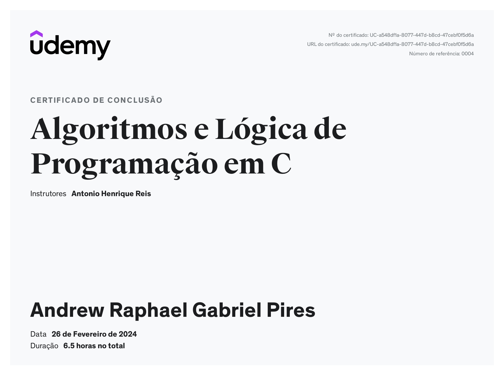

<h1 align="center">Algoritmos e Lógica de Programação em C</h1>

  <a href="#-tecnologias">Tecnologias</a>&nbsp;&nbsp;&nbsp;|&nbsp;&nbsp;&nbsp;
  <a href="#-projeto">Projeto</a>&nbsp;&nbsp;&nbsp;|&nbsp;&nbsp;&nbsp;

 

  

## 🚀 Tecnologias

Esse projeto foi desenvolvido com as seguintes tecnologias:

- C
- Git e Github

## 💻 Projeto

- Entender e aplicar as estruturas básicas da programação de computadores.
- Usar variáveis e seus tipos de dados.
- Fazer a Entrada, processamento e saída de dados.
- Fazer programas com o uso de Desvios condicionais (Simples, Composto, Encadeado e Múltiplos Casos)
- Fazer uso de Laços de repetições: For, While e Do-While.
- Aprender a usar os operadores lógicos: E , OU.
- Trabalhar com Vetores Unidimensionais e Multidimensionai

